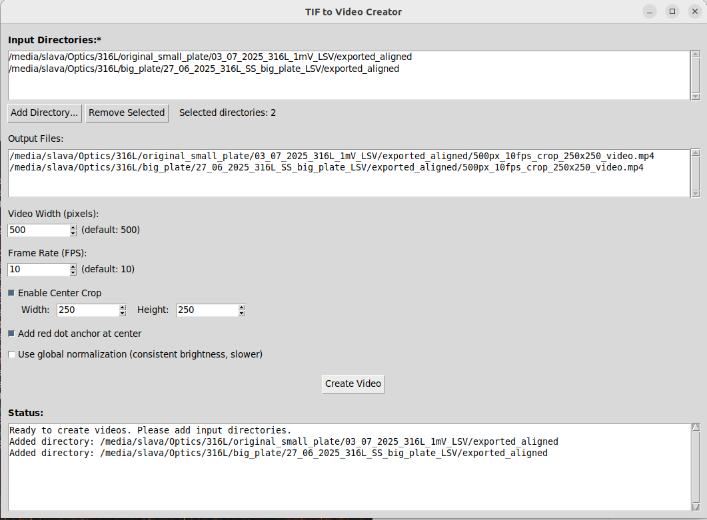

# TIF to Video Creator

A user-friendly Python application for converting sequences of 16-bit TIF images into MP4 videos with advanced normalization options and batch processing capabilities.



## Overview

This tool is designed for researchers and scientists working with microscopy, scientific imaging, or any 16-bit TIF image sequences. It provides both a graphical user interface (GUI) and command-line interface (CLI) to convert image sequences into videos with precise control over normalization, resolution, frame rate, and cropping.

**Key capabilities:**

- Batch processing of multiple directories with consistent parameters
- Local or global brightness normalization
- Automatic output file naming based on processing parameters
- Real-time progress tracking
- Maintains aspect ratio during resizing
- Center cropping with optional anchor point visualization

## Features

✅ **Dual Interface:** User-friendly GUI (default) or command-line mode (--nogui)
✅ **Batch Processing:** Process multiple directories sequentially with the same parameters
✅ **Smart Normalization:** Choose between local (per-frame) or global (consistent brightness) normalization
✅ **Parallel Processing:** Multiprocessing support for 4-8x faster performance on multi-core systems
✅ **Flexible Output:** Automatic descriptive file naming based on processing parameters
✅ **Center Cropping:** Crop to a specific region of interest with pixel-precise control
✅ **Visual Anchor:** Optional red dot marker at frame center for tracking
✅ **Progress Tracking:** Live progress bars and status updates
✅ **Error Handling:** Robust processing with per-directory error reporting

## Requirements

- **Python:** 3.8 or higher
- **Operating System:** Linux, macOS, or Windows
- **Dependencies:** See `requirements.txt`

### Python Packages

```
opencv-python>=4.5.0
numpy>=1.20.0
Pillow>=9.0.0
tqdm>=4.60.0
```

**Note:** `tkinter` is required for GUI mode and is typically included with Python installations. If not available, install it via your system package manager:

- **Ubuntu/Debian:** `sudo apt-get install python3-tk`
- **Fedora:** `sudo dnf install python3-tkinter`
- **macOS:** Included with Python from python.org
- **Windows:** Included with standard Python installation

## Installation

1. **Clone or download this repository:**
   
   ```bash
   cd /path/to/your/workspace
   git clone <repository-url>
   cd video_interface_try
   ```

2. **Install dependencies:**
   
   ```bash
   pip install -r requirements.txt
   ```

3. **Verify installation:**
   
   ```bash
   python3 create_video.py --help
   ```

## Usage

### GUI Mode (Default)

Simply run the script without arguments to launch the graphical interface:

```bash
python3 create_video.py
```

#### GUI Workflow:

1. **Add Input Directories:**
   
   - Click "Add Directory..." to select folders containing TIF images
   - Add multiple directories for batch processing
   - Remove unwanted directories with "Remove Selected"

2. **Configure Parameters:**
   
   - **Video Width:** Target width in pixels (height maintains aspect ratio)
   - **Frame Rate (FPS):** Video playback speed
   - **Enable Center Crop:** Crop to a specific region (Width × Height in pixels)
   - **Add red dot anchor:** Visual marker at frame center
   - **Use global normalization:** Consistent brightness across all frames (slower)

3. **Review Output Files:**
   
   - The "Output Files" section shows where each video will be saved
   - Filenames automatically include processing parameters
   - Example: `500px_10fps_crop_250x250_video.mp4`

4. **Create Videos:**
   
   - Click "Create Video" to start processing
   - Monitor progress in the Status area
   - Videos are saved in their respective input directories

### CLI Mode (--nogui)

For automated workflows, batch scripts, or remote processing:

```bash
python3 create_video.py --nogui /path/to/tiff_images [OPTIONS]
```

#### Basic Examples:

**Simple conversion (default settings):**

```bash
python3 create_video.py --nogui /path/to/tiff_images
```

**Custom resolution and frame rate:**

```bash
python3 create_video.py --nogui /path/to/tiff_images --width 800 --fps 15
```

**With center crop:**

```bash
python3 create_video.py --nogui /path/to/tiff_images --crop 500x500
```

**With global normalization:**

```bash
python3 create_video.py --nogui /path/to/tiff_images --global-normalize
```

**With parallel processing (faster on multi-core systems):**

```bash
python3 create_video.py --nogui /path/to/tiff_images --workers 8
```

**Full customization:**

```bash
python3 create_video.py --nogui /path/to/tiff_images \
  --output my_video.mp4 \
  --width 1000 \
  --fps 20 \
  --crop 600x600 \
  --anchor \
  --global-normalize \
  --workers 8
```

## Parameters Guide

### Video Width (pixels)

- **Default:** 500
- **Range:** 100-4000
- **Description:** Target video width. Height is automatically calculated to maintain the original aspect ratio.
- **Example:** `--width 800` creates an 800-pixel wide video

### Frame Rate (FPS)

- **Default:** 10
- **Range:** 1-120
- **Description:** Video playback speed in frames per second. Higher values create smoother but faster playback.
- **Example:** `--fps 15` creates a 15 FPS video

### Center Crop

- **Default:** Disabled (entire image is used)
- **Format:** WIDTHxHEIGHT (e.g., 500x500)
- **Description:** Crops the center region of each frame to the specified dimensions before resizing. Useful for focusing on a specific area of interest.
- **Example:** `--crop 600x400` crops to 600×400 pixels from the center

### Anchor Point

- **Default:** Disabled
- **Description:** Adds a red dot at the center of each frame for visual tracking or reference.
- **Usage:** `--anchor` (CLI) or checkbox (GUI)

### Global Normalization

- **Default:** Local normalization (per-frame)
- **Description:**
  - **Local (default):** Each frame is normalized independently. Faster processing, but brightness may vary between frames.
  - **Global:** All frames share the same min/max values for normalization. Consistent brightness across the entire video, but requires two passes (slower).
- **Usage:** `--global-normalize` (CLI) or checkbox (GUI)

### Parallel Workers

- **Default:** CPU count - 1 (automatic)
- **Range:** 1 to number of CPU cores
- **Description:** Number of parallel worker processes for faster image processing. Uses Python's multiprocessing module to parallelize CPU-intensive operations like image loading, normalization, and resizing. Provides significant speedup (4-8x) on multi-core systems.
- **Performance:**
  - **1 worker:** Sequential processing (slowest, lowest memory)
  - **2-4 workers:** Good balance for most systems
  - **8+ workers:** Maximum performance on high-end systems
- **Usage:** `--workers 4` (CLI) or automatic in GUI mode
- **Example:** `--workers 8` to use 8 parallel workers

## Output Files

Output videos are automatically saved in the input directory with descriptive filenames based on processing parameters:

### Filename Format:

```
<width>px_<fps>fps[_crop_<width>x<height>][_global_norm]_video.mp4
```

### Examples:

| Parameters                         | Output Filename                                  |
| ---------------------------------- | ------------------------------------------------ |
| 500px, 10fps                       | `500px_10fps_video.mp4`                          |
| 800px, 15fps                       | `800px_15fps_video.mp4`                          |
| 500px, 10fps, crop 250×250         | `500px_10fps_crop_250x250_video.mp4`             |
| 500px, 10fps, global norm          | `500px_10fps_global_norm_video.mp4`              |
| 800px, 20fps, crop 300×300, global | `800px_20fps_crop_300x300_global_norm_video.mp4` |

## Batch Processing

The GUI mode supports batch processing of multiple directories with identical parameters:

1. Add multiple input directories (2, 5, 10, or more)
2. Set your desired parameters once
3. Click "Create Video"
4. The tool processes each directory sequentially
5. Progress shows: "Processing directory 2 of 5: /path/to/dir..."
6. Summary report shows successful/failed counts

**Benefits:**

- Process entire experimental datasets consistently
- Unattended processing of large batches
- Individual error handling (one failure doesn't stop the batch)
- Clear logging for each directory

**Example output:**

```
================================================================================
Processing directory 1 of 3
Directory: /path/to/experiment1
================================================================================

Found 150 images
Estimated video duration: 15.0 seconds (0.2 minutes)
Creating video...
Processing frames: 100%|████████████████████| 150/150

✓ Successfully completed directory 1/3

================================================================================
Processing directory 2 of 3
Directory: /path/to/experiment2
================================================================================
...

================================================================================
BATCH PROCESSING COMPLETE
================================================================================
Total directories: 3
Successful: 3
Failed: 0
```

## Performance

### Multiprocessing Optimization

The script uses parallel processing to significantly speed up video creation on multi-core systems:

**Processing Pipeline:**
1. **Image Loading & Normalization:** Parallelized across worker processes
2. **Resizing & Cropping:** Parallelized across worker processes
3. **Video Writing:** Sequential (required by OpenCV VideoWriter)

**Typical Performance (1000 images):**

| Workers | Pass 1 (Global Min/Max) | Pass 2 (Processing) | Total Time | Speedup |
|---------|------------------------|---------------------|------------|---------|
| 1       | ~60s                   | ~120s               | ~180s      | 1.0x    |
| 2       | ~35s                   | ~70s                | ~105s      | 1.7x    |
| 4       | ~20s                   | ~40s                | ~60s       | 3.0x    |
| 8       | ~10s                   | ~25s                | ~35s       | 5.1x    |

*Performance depends on CPU cores, disk I/O speed, and image dimensions*

**Tips for Best Performance:**
- Use SSD storage for input images (disk I/O is often the bottleneck)
- Set `--workers` to match your CPU core count
- For small batches (<100 images), overhead may exceed benefits
- GUI mode automatically uses optimal worker count

**When to Use Single Worker (`--workers 1`):**
- Limited RAM (each worker needs memory)
- Slow hard drive (parallel I/O may cause thrashing)
- Very small image batches
- Debugging or troubleshooting

## Troubleshooting

### Issue: "No TIF images found"

**Solution:** Ensure your directory contains `.tif` or `.tiff` files. The script looks for both extensions.

### Issue: GUI doesn't launch / tkinter import error

**Solution:** Install tkinter via your system package manager:

- Ubuntu/Debian: `sudo apt-get install python3-tk`
- Fedora: `sudo dnf install python3-tkinter`

### Issue: Video plays too fast/slow

**Solution:** Adjust the FPS parameter. Lower FPS = slower playback, higher FPS = faster playback.

### Issue: Brightness varies between frames

**Solution:** Enable "Global normalization" for consistent brightness across all frames. Note: This is slower as it requires two passes through the images.

### Issue: Out of memory errors

**Solution:**

- Process fewer/smaller images
- Reduce the target width
- Close other applications
- Process directories individually rather than in large batches

### Issue: Video appears zoomed in

**Solution:** You may have center crop enabled. Disable cropping or adjust crop dimensions.

### Issue: High memory usage with multiprocessing

**Solution:** Reduce the number of workers:
```bash
--workers 2
```
Each worker process loads images into memory, so fewer workers = less memory usage.

### Issue: No performance improvement with multiprocessing

**Possible Causes:**
- Disk I/O bottleneck (slow hard drive)
- Single-core or dual-core CPU
- Small number of images (overhead > benefit)

**Solutions:**
- Use SSD storage for faster disk access
- Increase batch size (more images)
- Check disk usage: `iostat -x 1` (Linux) while processing
- For very small batches, use `--workers 1`

## Technical Details

### Normalization Methods

**Local Normalization (Default):**

- Each frame is normalized independently using its own min/max pixel values
- Formula: `normalized = (pixel - frame_min) / (frame_max - frame_min) × 255`
- **Pros:** Fast processing, single pass through images
- **Cons:** Brightness may vary between frames
- **Best for:** Stable lighting conditions, preview videos, faster processing

**Global Normalization:**

- All frames share the same min/max values from the entire sequence
- **Pass 1:** Scan all images to find global min/max
- **Pass 2:** Normalize all frames using global values
- Formula: `normalized = (pixel - global_min) / (global_max - global_min) × 255`
- **Pros:** Consistent brightness across entire video
- **Cons:** Requires two passes (slower)
- **Best for:** Publication-quality videos, sequences with varying brightness, scientific analysis

### Image Processing Pipeline

**Parallel Phase (Steps 1-4):**
1. **Load:** Read 16-bit TIF image (parallelized)
2. **Crop (optional):** Extract center region if crop is enabled (parallelized)
3. **Normalize:** Convert 16-bit → 8-bit using local or global min/max (parallelized)
4. **Resize:** Scale to target width maintaining aspect ratio (parallelized)

**Sequential Phase (Steps 5-6):**
5. **Anchor (optional):** Add red dot at center (main thread)
6. **Encode:** Write frame to MP4 video with mp4v codec (main thread)

**Note:** Video writing must be sequential because OpenCV's VideoWriter is not thread-safe.

### Supported Image Formats

- **Input:** 16-bit TIF/TIFF images (grayscale or color)
- **Output:** MP4 video (H.264 compatible codec)

## Examples

### Example 1: Quick Preview Video

Create a fast preview at default settings:

```bash
python3 create_video.py --nogui /path/to/images
```

**Output:** `500px_10fps_video.mp4` in the input directory

---

### Example 2: High-Quality Publication Video

High resolution with consistent brightness and fast parallel processing:

```bash
python3 create_video.py --nogui /path/to/images \
  --width 1200 \
  --fps 15 \
  --global-normalize \
  --workers 8
```

**Output:** `1200px_15fps_global_norm_video.mp4`
**Performance:** ~5x faster than sequential processing on 8-core system

---

### Example 3: Focused Region with Tracking

Crop to region of interest with center marker:

```bash
python3 create_video.py --nogui /path/to/images \
  --width 800 \
  --fps 20 \
  --crop 400x400 \
  --anchor
```

**Output:** `800px_20fps_crop_400x400_video.mp4` with red center dot

---

### Example 4: Batch Processing (GUI)

1. Launch GUI: `python3 create_video.py`
2. Add directories:
   - `/data/experiment1/images`
   - `/data/experiment2/images`
   - `/data/experiment3/images`
3. Set parameters: 500px, 10fps, crop 300×300, global normalization
4. Click "Create Video"
5. Results:
   - `/data/experiment1/images/500px_10fps_crop_300x300_global_norm_video.mp4`
   - `/data/experiment2/images/500px_10fps_crop_300x300_global_norm_video.mp4`
   - `/data/experiment3/images/500px_10fps_crop_300x300_global_norm_video.mp4`

## License

This work is licensed under **CC BY 4.0** (Creative Commons Attribution 4.0 International License).

You are free to:

- **Share** — copy and redistribute the material in any medium or format
- **Adapt** — remix, transform, and build upon the material for any purpose, even commercially

Under the following terms:

- **Attribution** — You must give appropriate credit, provide a link to the license, and indicate if changes were made.

For more details, see: [https://creativecommons.org/licenses/by/4.0/](https://creativecommons.org/licenses/by/4.0/)

## Author

**Viacheslav (Slava) Shkirskiy**

- 🌐 Website: [https://slava-shkirskiy.org/](https://slava-shkirskiy.org/)
- 📧 Contact: viacheslava.shkirskiy@cnrs.fr

For support, questions, or feedback, please contact via email.
